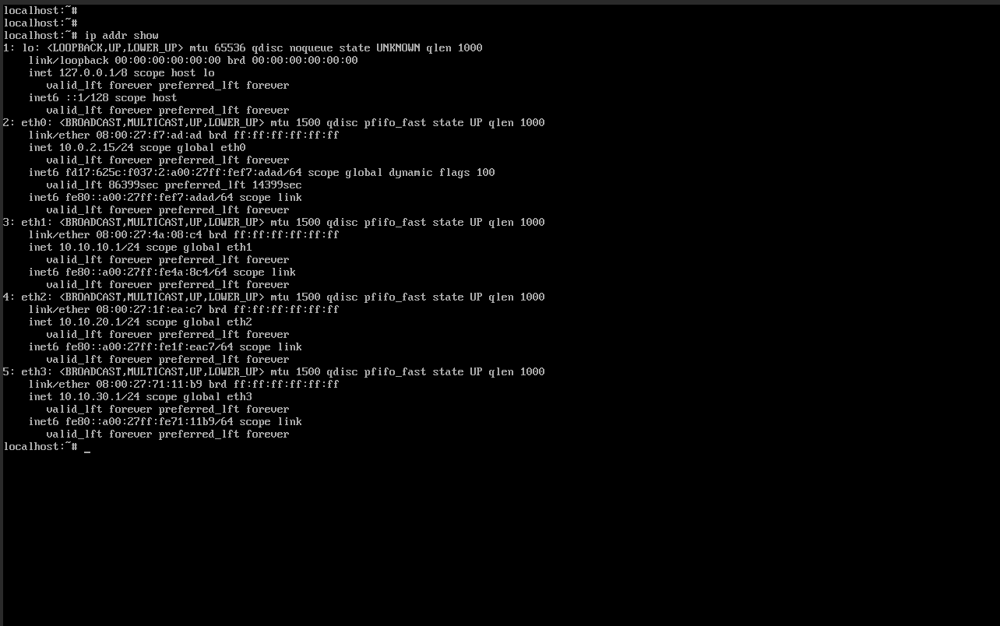
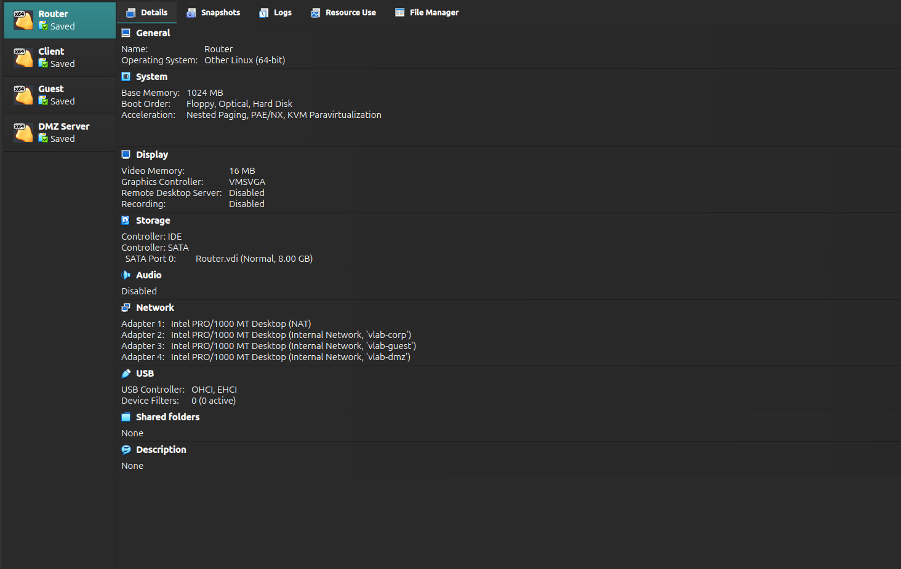
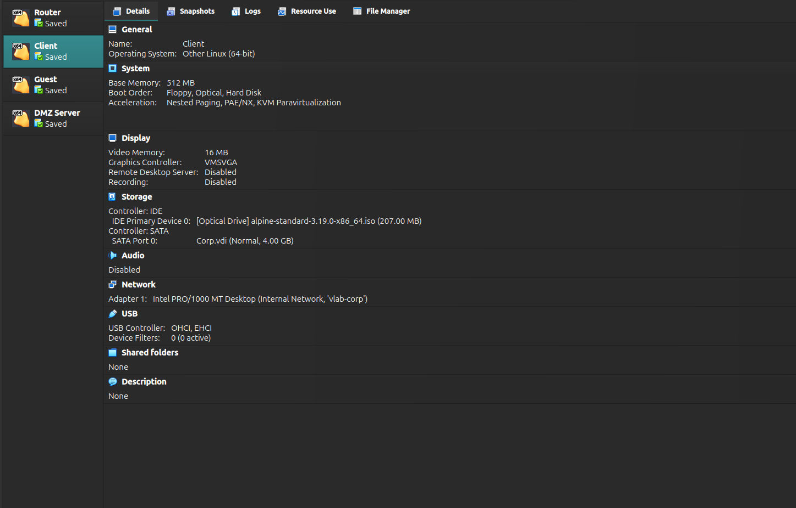
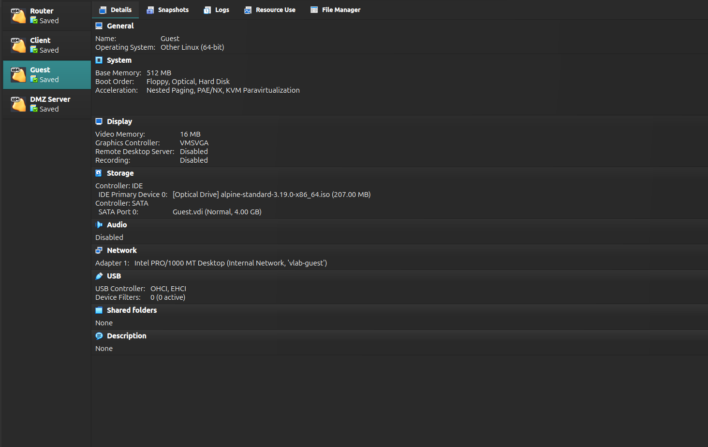
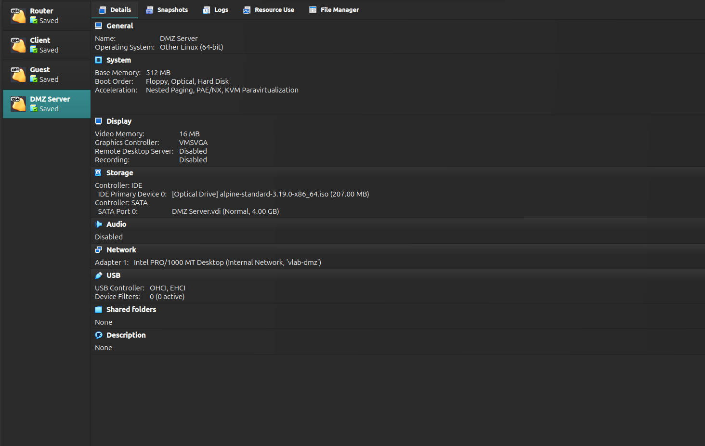
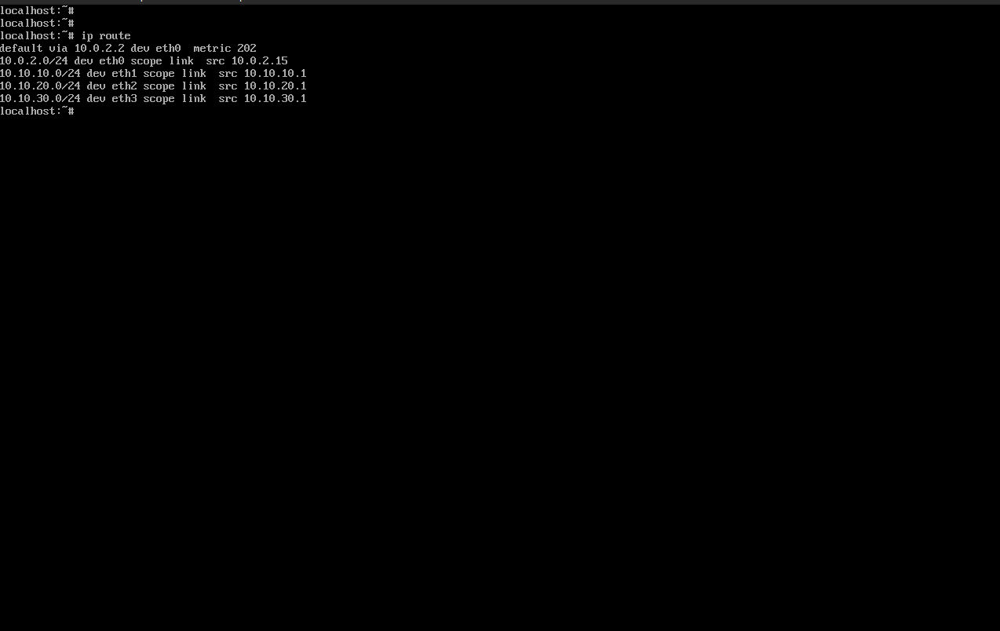
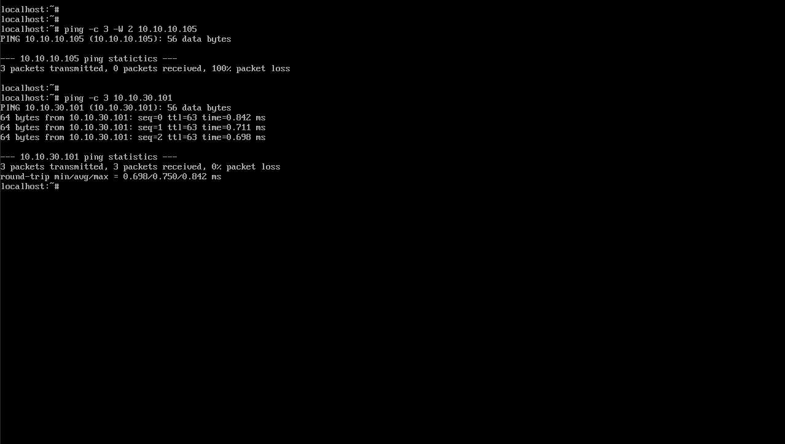
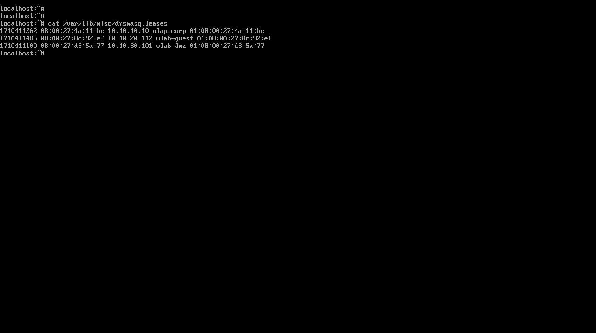

# Virtual Home Lab with Segmented Networks

## Overview

Most entry level networking and cybersecurity roles assume you understand:

- **Why segmentation matters**
- **How devices get configured automatically**
- **How communication is controlled**

Creating a **virtualized network lab** using free virtualization tools such as virtualbox that simulates common enterprise zones:

- **Corp** (trusted internal network)
- **Guest** (limited access)
- **DMZ** (public facing services)

A dedicated virtual router VM routes between segments, provides DHCP, and enforces firewall rules that control what can talk to what.

> This lab is intentionally designed for hands on learning: break things, fix them, and validate behavior with testing ping, DNS lookups, and service access checks.

---

## Tools

**Virtualization**
- Oracle VirtualBox
- Virtual networking: NAT, Internal Network

**Network Services**
- DHCP
- DNS

**Security / Routing**
- Router/Firewall VM
- Basic stateful firewall rules
- Inter VLAN routing and segmentation controls

---

## Architecture 

### Network Zones
- **NAT**: Internet access for updates and testing
- **Corp VLAN**: internal clients
- **Guest VLAN**: restricted clients
- **DMZ VLAN**: servers exposed to limited inbound access

### Topology
                [ Internet ]
                    |
               (NAT Adapter)
                    |
            [ Router / Firewall ]
            /        |         \
    Corp Segment    Guest      DMZ
    (vlab-corp)  (vlab-guest) (vlab-dmz)
         |             |           |
    [Corp VM]     [Guest VM]   [DMZ Server]

 ---

## Methodology

### 1) Create the Virtual Networks
1. Create **Internal Networks** for each segment:
   - `vlab-corp`
   - `vlab-guest`
   - `vlab-dmz`
2. Subnets:
   - Corp: `10.10.10.0/24`
   - Guest: `10.10.20.0/24`
   - DMZ: `10.10.30.0/24`

### 2) Build the Router VM
1. Deploy router.
2. Assign NICs:
   - **WAN**: NAT
3. Configure interface IPs:
   - Corp: `10.10.10.1`
   - Guest: `10.10.20.1`
   - DMZ: `10.10.30.1`

### 3) Configure DHCP Per Segment
1. Enable DHCP on each internal interface.
2. Define scopes:
   - Corp DHCP: `10.10.10.100-10.10.10.199`
   - Guest DHCP: `10.10.20.100-10.10.20.199`
   - DMZ: `10.10.30.100-10.10.30.150`

### 4) Configure DNS
- Router based DNS forwarder for all segments

### 5) Apply Firewall Policy 

Baseline policy:
- **Guest → Corp:** Block
- **Guest → DMZ:** Allow only required services 
- **Corp → DMZ:** Allow administrative access 
- **DMZ → Corp:** Block 
- **All segments → WAN:** Allow outbound

---

## Key Findings

- **Segmentation works as a control, not a concept:** enforcing boundaries with routing + firewall rules prevents unintended access and reduces blast radius.
- **DHCP + DNS are foundational:** most “network is down” scenarios are misconfigurations here.
- **Firewall logging is a learning accelerator:** observing blocked vs. allowed traffic builds intuition around stateful behavior and rule order.
- **DMZ design changes default trust:** DMZ services can be reachable without exposing Corp, aligning with real world enterprise patterns.

---

## Skills Demonstrated

- **Network Segmentation**
- **Routing & Inter Segment Traffic Control**
- **Firewall Policy Design**
- **DHCP Scope Design & Troubleshooting**
- **DNS Configuration & Validation**
- **Network Testing & Verification**
- **Operational Troubleshooting** 
- **Documentation & Architecture Communication**

---

## Images

  
   
  <em>Fig 1: Router network interfaces displaying configured gateway IPs</em>

---

  
   
  <em>Fig 2: VirtualBox Router VM settings</em>

---

  
   
  <em>Fig 3: Internal network configuration for the Client VM attached to vlab-corp</em>

---

  
   
  <em>Fig 4: Internal network configuration for the Guest VM attached to vlab-guest</em>

---

  
   
  <em>Fig 5: Internal network configuration for the DMZ Server VM attached to vlab-dmz.</em>

---

  
   
  <em>Fig 6: Intersegment routing table showing direct routes for all subnets and default WAN gateway</em>

---

  
   
  <em>Fig 7: Validation of network controls. Guest client ping to Corp segment is blocked, while traffic to DMZ server succeeds</em>

---

  
   
  <em>Fig 8: Active DHCP lease logs verified on the router via dnsmasq across Corp, Guest, and DMZ subnets</em>

---

## License

This project is licensed under the MIT License [LICENSE](https://github.com/tazbikislam/Virtual-Home-Lab-with-Segmented-Networks/blob/main/LICENSE)  

---

## Contact

- **Email**: [tazbikislam.work@gmail.com](mailto:tazbikislam.work@gmail.com)
